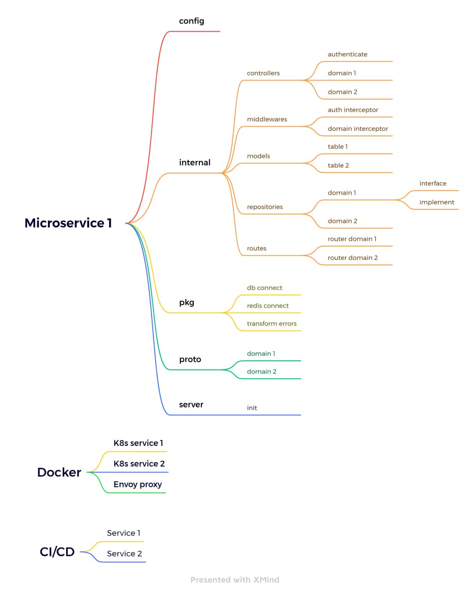

# Overview golang gRPC structure


# config and install

## Option 1 (use docker micro1)
### config .env.docker.example
```
// if use docker run micro1
cp .env.docker.example => micro1/.env
```
### run all services on docker
```
docker-compose up -d --build
```
## Option 2 (don't use docker micro1)
### install golang
```
example /d/Go
```
### install protoc gen code
go to: https://github.com/google/protobuf/releases

```
// install on window download this
https://github.com/protocolbuffers/protobuf/releases/download/v22.2/protoc-22.2-win64.zip
```
```
Extract all to D:/Go/protoc 
Your directory structure should now be
D:\protoc\bin 
D:\protoc\include
Finally, add D:\protoc\bin to your PATH
```
```
// updated ~/.bashrc

export GOPATH='/d/Go/bin'
export PATH=$PATH:'/d/Go/bin'
export PATH=$PATH:'/d/Go/protoc/bin'
export PATH="$PATH:$GOPATH/bin"
```
```
// reload source bash
cd ~
source .bashrc
```
```
// install protoc-gen-go, protoc-gen-go-grpc

go install google.golang.org/protobuf/cmd/protoc-gen-go@v1.30
go install google.golang.org/grpc/cmd/protoc-gen-go-grpc@v1.3
```
```
// sync download missing source code
go mod tidy
```

### config .env.local.example
```
// if don't use docker run micro1
cp .env.local.example => micro1/.env
```
### run docker (only db, redis) and run micro1 without docker and hot reload code (development)
```
docker-compose up -d --build db redis
cd /micro1
go install github.com/cosmtrek/air@latest
air -c .air.toml
```

# Tools
### Golang lint refactor code on windows

```
# binary will be $(go env GOPATH)/bin/golangci-lint
curl -sSfL https://raw.githubusercontent.com/golangci/golangci-lint/master/install.sh | sh -s -- -b $(go env GOPATH)/bin v1.52.2

golangci-lint --version
```

### Golang lint refactor code on others please read https://golangci-lint.run/usage/install/
